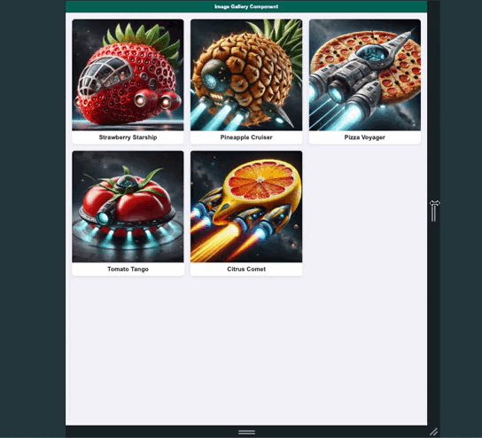

# CSS Grid Image Gallery

## 🎨 Introducción

Como hemos visto **CSS Grid** es un sistema de diseño bidimensional que permite organizar y distribuir elementos en filas y columnas de forma flexible y eficiente, creando layouts responsivos y complejos con facilidad.

## 🎯 Objetivo:

Crear una galería de imágenes utilizando **HTML** y **CSS Grid**, donde las imágenes se visualicen con sus títulos y mantengan proporciones, ajustándose a diferentes tamaños de pantalla de manera **responsiva**. Además, deberás gestionar el proyecto en un repositorio de Git y realizar **commits semánticos** para mantener un historial de cambios claro y organizado.

### Ejemplo:

## 📝 Instrucciones:

1. **Crea un repositorio en GitHub**:
   - Crea un nuevo repositorio en GitHub llamado `css-grid-gallery`.
   - Clona el repositorio en tu máquina local.
2. **Crea un archivo HTML** llamado `gallery.html`.
3. **Crea un archivo CSS** llamado `gallery.css` y vincúlalo al archivo HTML utilizando la etiqueta `<link>`.
4. Dentro del archivo HTML, crea una estructura de galería con las imágenes y sus títulos correspondientes.
5. Aplica **CSS Grid** para crear una cuadrícula que permita que las imágenes se reorganicen en diferentes tamaños de pantalla y se visualicen sin deformaciones.
6. Realiza **commits semánticos** para cada cambio importante en el proyecto siguiendo el formato:

   - `feat`: Para añadir nuevas características o funcionalidades.
   - `fix`: Para corregir errores.
   - `style`: Para cambios relacionados con el estilo (formato, espaciado, etc.).
   - `refactor`: Para refactorización de código sin cambios funcionales.
   - `docs`: Para cambios en la documentación.

   Ejemplo de commit: `feat: add CSS grid layout for responsive gallery`.

## 🛠️ Requisitos:

1. **Estructura HTML básica**:
   - Un contenedor `
` con la clase `gallery` que contenga varios elementos `
` con la clase `gallery-item`.
   - Cada elemento `gallery-item` debe incluir:
     - Una imagen (``), ya sea un archivo local o un enlace externo.
     - Un título (`<h3>`) debajo de la imagen.
2. **Estilos CSS**:
   - Utiliza **CSS Grid** para definir una galería responsiva que mantenga las proporciones de las imágenes.
   - Las imágenes deben ajustarse al mismo tamaño dentro de la cuadrícula sin perder sus proporciones ni deformarse.
   - Usa `object-fit: cover;` para asegurar que las imágenes no se deformen y mantengan su aspecto visual adecuado.
   - Define un espaciado adecuado (`gap`) entre los elementos de la galería.
   - La galería debe reorganizarse automáticamente dependiendo del tamaño de la pantalla, utilizando la propiedad `grid-template-columns` con `repeat()` y `minmax()`.
   - Aplica un diseño de cuadrícula responsivo utilizando **media queries** para adaptar el número de columnas en diferentes tamaños de pantalla (por ejemplo: 3 columnas en pantallas grandes, 2 columnas en medianas, y 1 columna en pantallas pequeñas).
3. **Control de versiones**:
   - Realiza commits semánticos para cada cambio importante en el proyecto.
   - Al finalizar, **sube los cambios** al repositorio de GitHub.

### 🧪 Evaluación:

- La galería debe ser **responsiva**, adaptándose a diferentes tamaños de pantalla.
- Las imágenes deben mostrarse sin deformarse y con un tamaño uniforme.
- Los títulos deben aparecer debajo de las imágenes de manera clara.
- La disposición de las imágenes debe cambiar dinámicamente según el tamaño de la pantalla.
- Los commits deben seguir el formato de **commits semánticos** para organizar los cambios realizados en el proyecto.
